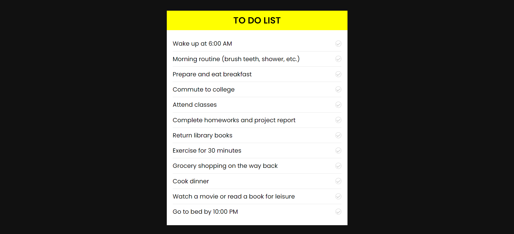
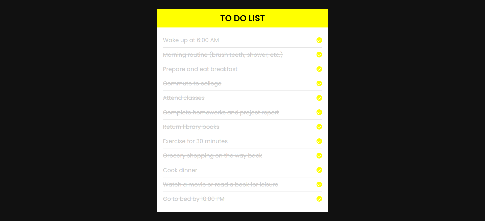

# TO-DO LIST USING HTML AND CSS

## Introduction
A to-do list is a simple and efficient tool for managing daily tasks and task management. The goal of this project is to use HTML and CSS to build a simple to-do list online application. Users of the initiatives will be able to add new tasks, mark existing tasks as complete, and delete existing tasks from the list.

## Features
The to-do list project will include the following features:
 
1) **Add New Tasks:** Users can enter a task in the input field provided and click the "Add Task" button to add it to the list. The newly added task will appear as an item in the to-do list.
2) **Task Completion:** Each task in the list will have a checkbox associated with it. Users can mark a task as completed by clicking the checkbox. Completed tasks will be visually differentiated from active tasks.
3) **Task Removal:** Users can remove completed tasks from the list by clicking the "Clear Completed Tasks" button. This action will remove all completed tasks, keeping the active tasks in the list.

## Design Overview
The project's design will follow a clean and minimalist approach to maintain a user-friendly interface. The application will be contained within a central container, which will hold the header, input section, task list, and the button to clear completed tasks. The task list will be represented using an unordered list element, with each task item as a list item. The tasks will be visually formatted to provide a clear distinction between active and completed tasks.

## CSS Styling
The CSS styling for the to-do list project will focus on creating an appealing and responsive layout. The styles will include appropriate margins, padding, and font choices to enhance readability and usability. The use of subtle transitions and hover effects will provide visual feedback to users when interacting with the elements. Completed tasks will have a distinct visual representation, such as a strike-through text decoration and reduced opacity. This differentiation will make it easy for users to identify completed tasks at a glance.

## Responsive Design
The to-do list application will be designed with responsiveness in mind. It will adapt to different screen sizes and devices, ensuring that users can comfortably access and use the application on various platforms, including desktops, tablets, and mobile phones. Media queries will be utilized to adjust the layout, font size, and other design elements based on the screen size, providing an optimal user experience across different devices.

## Conclusion
This basic to-do list project offers a simple yet functional solution for organizing tasks and managing daily activities. Its implementation using HTML and CSS makes it accessible to a wide range of users without relying on complex technologies. The project can serve as a starting point for further enhancements, such as integrating JavaScript for more advanced functionalities like task persistence and real-time updates.

## Snapshots

   
  To-Do List (When the tasks are yet to start)

 

   
  To-Do List (When all the tasks are completed)

